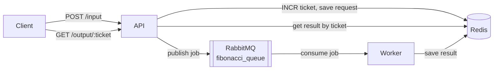

# Fibonacci fun project

Test Project for Fibonacci Numbers.

### Requirements
- Git ([download](https://git-scm.com/downloads))
- Docker ([download](https://docs.docker.com/get-docker/))

### Run project in docker
```bash
git clone https://github.com/vasyl-chyypesh/fibonacci-test.git

cd fibonacci-test

docker compose up --build
```

### Access the API Documentation and Test Interface

Once the Docker containers are running, open your browser and navigate to [http://localhost:8080](http://localhost:8080) to view the interactive API documentation and try out the available endpoints via the UI.

### Testing the API with curl

**Submit a Fibonacci calculation request:**

Send a POST request with your number in the payload:

```bash
curl -d '{"number":7}' -H "Content-Type: application/json" -X POST http://localhost:3000/input
```

The API will respond with a JSON object containing a unique ticket ID, which you can use to check the status or retrieve the result:

```bash
{ "ticket": 1 }
```

**Retrieve the Fibonacci result by ticket:**

Use the ticket ID to query for your calculation result with a GET request:

```bash
curl http://localhost:3000/output/1
```

The response will include the original input number and its corresponding Fibonacci number:

```bash
{ "ticket": 1, "inputNumber": 7, "fibonacci": "13" }
```

### Health check

```bash
curl http://localhost:3000/health
```

Returns `200` with a status payload:

```bash
{ "message": "OK", "time": "2026-06-03T00:00:00.000Z" }
```

### System overview

Calculating a large Fibonacci number takes too long to answer inside an HTTP request, so the work is split across two Node.js processes that never call each other directly. The API accepts a number and hands back a ticket immediately; a worker does the arithmetic in the background. Redis carries the state between them, RabbitMQ carries the work.



A `POST /input` validates the payload, reserves a ticket by incrementing a Redis counter, stores the request under `fib_request_<ticket>`, publishes a durable job to RabbitMQ, and returns the ticket. The worker consumes that job, computes the value, and overwrites the same Redis key with the result. A later `GET /output/:ticket` reads the key directly and returns `404` until the worker has written a result.
